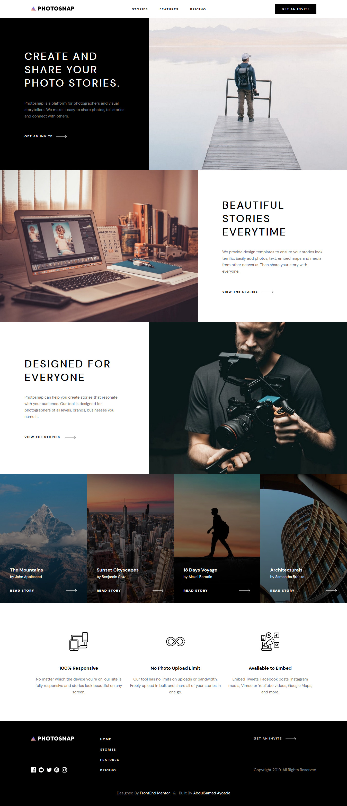

# Photosnap
 

This is an ongoing project.

Photosnap is a photography website designed by FrontEnd Mentor and coded by me. 

The project is a challenge from FrontEnd Mentor which I partake in.

Built using HTML, CSS, Sass and Javascript.

The project contains four pages which are :

1. Homepage
2. Stories
3. Features
4. Pricing

All the resources used in building this site were provided by FrontEnd Mentor.

Live URL = https://abdulsamadayoade.github.io/Photosnap
